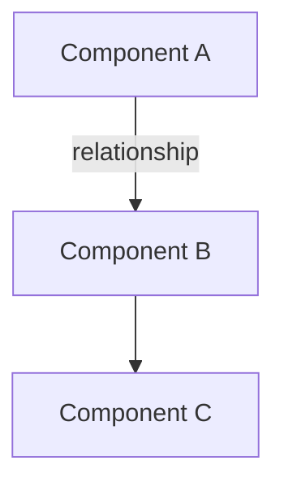

# [Concept Name]

**Purpose**: [One sentence explaining what concept this explains]
**Reading Time**: [X minutes]
**Prerequisites**: [Concepts to understand first, if any]

---

## Overview

[2-3 paragraphs introducing the concept at a high level. What is it? Why does it matter? How does it fit into the larger system?]

---

## Key Concepts

### [Sub-Concept 1]

[Explanation of the sub-concept]

**Example**:
```python
# Concrete code example demonstrating the concept
example_code_here()
```

**Why This Matters**: [Practical explanation of importance]

### [Sub-Concept 2]

[Continue pattern]

---

## How It Works

[Detailed explanation of the mechanism/process/architecture]

### [Component 1]

[Deep dive into first major component]

### [Component 2]

[Continue pattern]

---

## Architecture Diagram



[Explanation of the diagram and how components interact]

---

## Real-World Example

### Scenario

[Describe a concrete use case]

### Implementation

```python
# Complete working example
def example_function():
    # Implementation demonstrating concept
    pass
```

### Explanation

[Walk through the example step-by-step]

1. [What happens first]
2. [What happens next]
3. [Final result]

---

## Benefits and Trade-offs

### Benefits

- **Benefit 1**: [Why this is valuable]
- **Benefit 2**: [Another advantage]

### Trade-offs

- **Trade-off 1**: [What you give up]
- **Trade-off 2**: [When this might not be ideal]

---

## Best Practices

### Do

- ✓ Best practice 1
- ✓ Best practice 2

### Don't

- ✗ Anti-pattern 1
- ✗ Anti-pattern 2

---

## Related Concepts

This concept relates to:
- **[Related Concept 1]** - [Brief explanation of relationship]
- **[Related Concept 2]** - [Brief explanation of relationship]

---

## Further Reading

- [Link to implementation details](../development/...)
- [Link to related concept](../concepts/...)
- [Link to practical usage](../user-guide/...)

---

**Last Updated**: YYYY-MM-DD
**Feedback**: [Link to issue template]
**Related**: [concept-1.md](concept-1.md) | [concept-2.md](concept-2.md)
